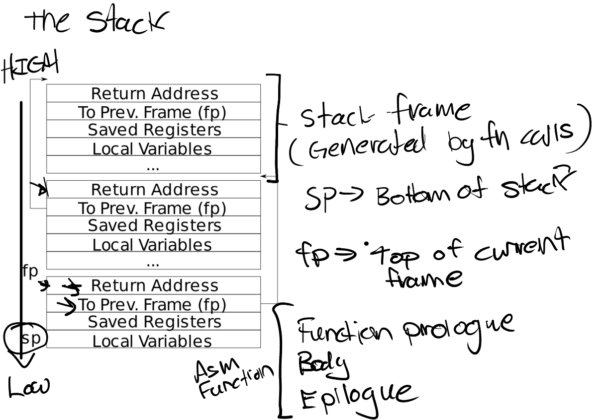

# Lab4: traps

本实验讨论如何使用traps实现系统调用

## 前置代码

### kernel/trampoline.S

这段代码在操作系统中实现用户态和内核态之间的切换，主要处理如何在用户空间和内核空间之间保存和恢复寄存器状态，以便发生系统调用、异常或中断时可以正确返回到用户的执行。

**`trampoline`区段的初始化：**

```nasm
 .section trampsec
.globl trampoline
trampoline:
.align 4
.globl uservec
```

这段代码指定了一个名为`trampsec`的段. 并声明了一个全局符号`trampoline`和`uservec`. 

**用户态trap的处理--`uservec`: trap入口**

- 首先保存用户态的寄存器到trapframe

  ```asm
    # swap a0 and sscratch
    csrrw a0, sscratch, a0

    # save the user registers in TRAPFRAME
    sd ra, 40(a0)
    sd sp, 48(a0)
    sd gp, 56(a0)
    ...
  ```

- 从trapframe中恢复内核的堆栈指针(`sp`), `tp`, 和内核的页表(`satp`寄存器), 并获取trap处理函数`usertrap()`的地址
  
  ```asm
    # restore kernel stack pointer from p->trapframe->kernel_sp
    ld sp, 8(a0)

    # make tp hold the current hartid, from p->trapframe->kernel_hartid
    ld tp, 32(a0)

    # load the address of usertrap(), p->trapframe->kernel_trap
    ld t0, 16(a0)

    # restore kernel page table from p->trapframe->kernel_satp
    ld t1, 0(a0)
    csrw satp, t1
    sfence.vma zero, zero
  ```

- 跳转到`usertrap()`
  
  ```asm
    # jump to usertrap(), which does not return
    jr t0

  ```

**从内核态切换回用户态: `userret`**

- 切换回用户页表

  ```asm
    # switch to the user page table.
  csrw satp, a1
  sfence.vma zero, zero

  # put the saved user a0 in sscratch, so we
  # can swap it with our a0 (TRAPFRAME) in the last step.
  ld t0, 112(a0)
  csrw sscratch, t0
  ```

- 从trapframe恢复所有用户寄存器状态

  ```asm
    # restore all but a0 from TRAPFRAME
  ld ra, 40(a0)
  ld sp, 48(a0)
  ld gp, 56(a0)
  ...
  ```

- 执行`sret`, 将控制权从内核返回到用户态, 它会恢复`sstatus`和`sepc`. 这两个寄存器在发生中断时设置, 以确保程序能从正确的位置继续
  
  ```asm
    # restore user a0, and save TRAPFRAME in sscratch
  csrrw a0, sscratch, a0

  # return to user mode and user pc.
  # usertrapret() set up sstatus and sepc.
  sret
  ```

### kernel/trap.c

这段代码是xv6中断和异常处理的实现, 主要包括用户态和内核态的中断, 异常处理机制, 以及系统调用和定时器中断的处理.

**`trapinit()`和`trapinithart()`**

- `trapinit()`初始化全局时钟锁`tickslock`, 用来保护全局变量`ticks`
- `trapinithart()`设置异常和中断向量表的入口地址为 `kernelvec`, 以便将所有硬件和软件异常转发到内核处理
  
**`usertrap()`**

`usertrap()`用于处理用户态触发的异常或中断, 其被 `trampoline.S`调用, 当用户程序发生异常或中断时, 会跳转到这里:

- 检查是否从用户模式进入: 通过检查`SSTATUS_SPP`判断. 如果不是从用户模式进入, 则触发panic
- 保存用户程序的程序计数器PC: 将当前程序计数器`sepc`保存到`trapframe`中
- 处理系统调用: 如果`scause`的值为8, 表明触发了系统调用, 调用`syscall()`来处理系统调用, 并确保恢复到系统调用后的下一条指令
- 如果是外部设备中断, 则调用`devintr()`处理
- 其他异常: 打印调试信息并标记为进程已被杀死, 然后退出

**`usertrapret()`**

`usertrapret()`是从内核返回到用户态调用的函数:

- 关闭中断
- 设置异常向量: 将异常向量设置为`usertrap()`, 去日报下一次触发异常时能跳回用户模式
- 设置`trapframe`: 保存当前进程的内核信息, 便于恢复用户态
- 恢复用户寄存器状态: 通过 `sret`指令返回用户态, 恢复用户程序的寄存器和PC
  
**`kerneltrap()`**

`kerneltrap()`是在内核态发生异常时处理的函数:

- 检查异常来源: 检查是否从内核模式进入, 如果不是则触发panic
- 处理中断: 通过 `devintr()`处理设备中断.
- 恢复trap寄存器: 恢复异常处理时保存的 `sepc`和 `sstatus`寄存器的值
  
**`clockintr()`**

定时器中断的处理函数, 增加全局变量`ticks`的值并唤醒等待定时器中断的进程

## Backtrace

这个实验的目的是实现一个回溯(backtrace)功能.

### xv6的栈帧结构



fp是当前函数栈顶指针, fp-8指向返回地址, fp-16指向原栈帧(调用函数的fp)

故进行backtrace时, 可以找到调用函数的fp(当前fp-16), 不断向前回溯, 直到抵达当前页的顶部.

对于每一次回溯, 都需要打印函数的返回地址, 即(fp-8)

故`backtrace()`如下:

```c
void backtrace(void) {
  uint64 fp = r_fp();//获取当前函数的frame point, 也指向栈帧顶部
  uint64 top = PGROUNDUP(fp); //获取当前页的顶部, 用于结束回溯
  printf("backtrace:\n");
  for(; fp < top; fp = *((uint64*)(fp-16))) { //每次回溯结束后, 需要找到caller的fp, 进入上一个函数
    printf("%p\n", *((uint64*)(fp-8))); //每次回溯内部, 需要打印返回地址
  }
}
```
